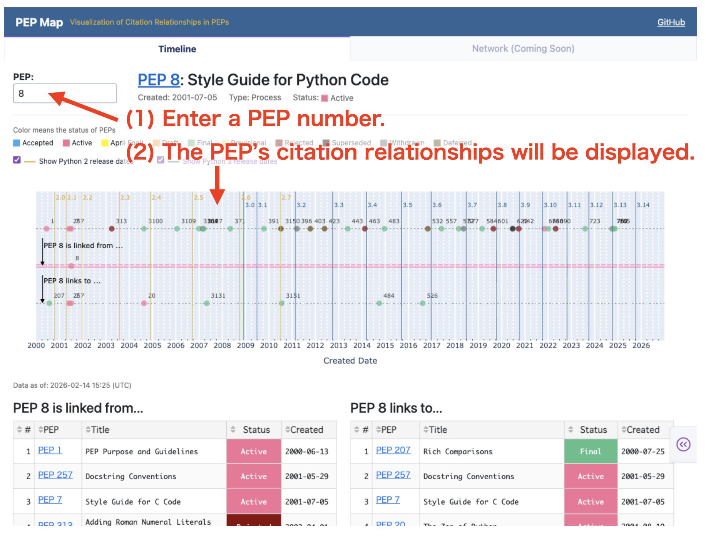

# PEP Map

## What is this?

PEP Map is a web application that **visualizes citation relationships between PEPs** (Python Enhancement Proposals).

- **Timeline:** Citation relationships between PEPs in chronological order
- **Network:** Citation relationships between PEPs as a network graph **(coming soon)**

## Timeline
Enter a PEP number in the text box on the left (e.g., 8).
The following information will be displayed in order of creation date:

- Which PEPs cite the selected PEP?
- Which PEPs does the selected PEP cite?



## Network
(coming soon)

##Local environment setup

```
$ python -m venv venv
(venv) $ source venv/bin/activate
(venv) $ pip install -r requirements.txt
```

```
(venv) $ python app.py
```