# PEP Map

## What is this?
**🐍PEP Map**: https://pep-map.onrender.com/


[PEP Map](https://pep-map.onrender.com/) is a web application that **visualizes citation relationships between PEPs** (Python Enhancement Proposals).

- **[Timeline tab](#timeline-tab):**
    - Explore citation relationships between PEPs **on a chronological timeline**.
    - It helps you trace the history of PEPs related to the selected PEP.
- **[Network tab](#network-tab):**
    - Explore citation relationships between PEPs **as a network graph**.
    - It helps you understand the relationships between PEPs and identify influential ones.
- **[Groups tab (beta)](#groups-tab):**
    - Explore groups of PEPs detected from the citation network using a community detection algorithm.
    - It helps you identify groups of related topics based on citation relationships.
    - **This feature is currently in beta. Automatic generation of group descriptions is planned.**
- **PEP Metrics tab:**
    - View structural metrics such as in-degree, out-degree, degree, and PageRank in a table format.
    - It helps you compare PEPs using quantitative network measures.
- **Citation Changes tab:**
    - View changes in citation relationships between PEPs detected by this system.
    - It helps you track newly added, changed, or removed citation relationships.

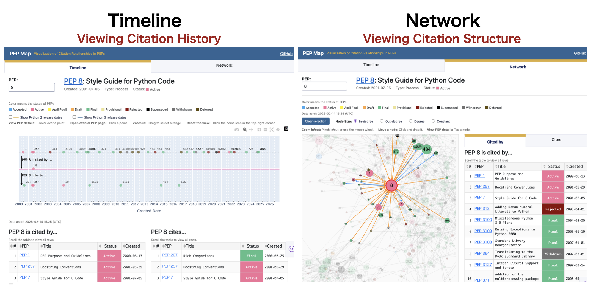
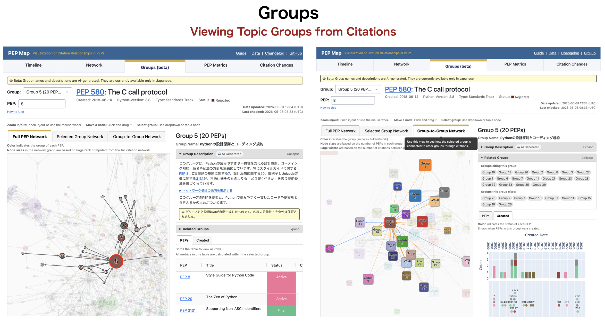

**Note:**
This project is a redesigned and reimplemented version of [pep_map_site](https://github.com/komo-fr/pep_map_site), originally built with Bokeh and PyScript.
It is now built using Dash.

## Timeline tab
### Viewing Citation History
Enter a PEP number in the left text box (e.g., 8).   
The following information is displayed in creation date order:

- PEPs that cite the selected PEP
- PEPs cited by the selected PEP

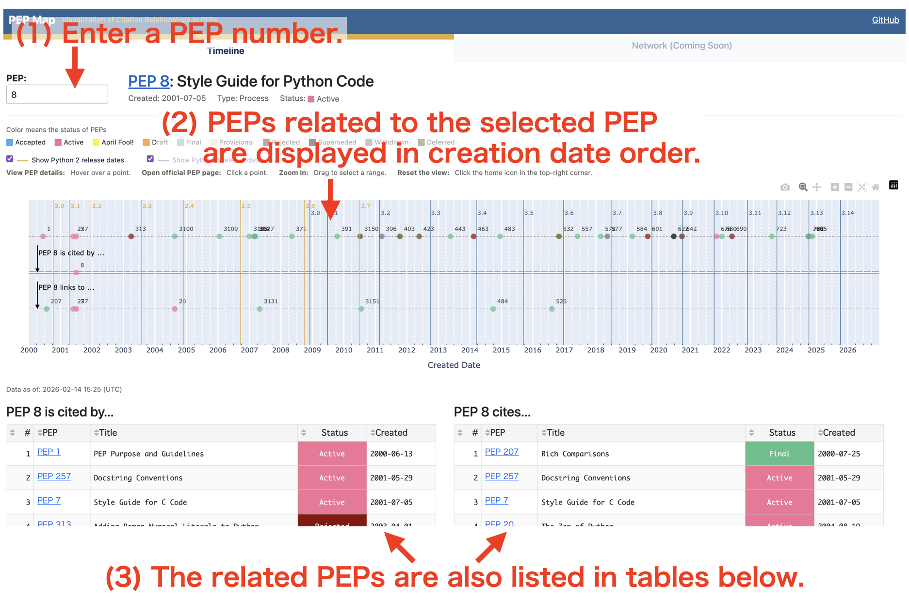

Enable the checkbox to show vertical lines for Python release dates.


### Interaction
Hover over a PEP data point on the timeline to see information about that PEP.   
Click the data point to open the official PEP document.

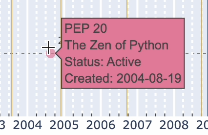

Select a range on the timeline to zoom in on that range.   
Click the home button (🏠) in the top-right corner of the timeline to reset the view.

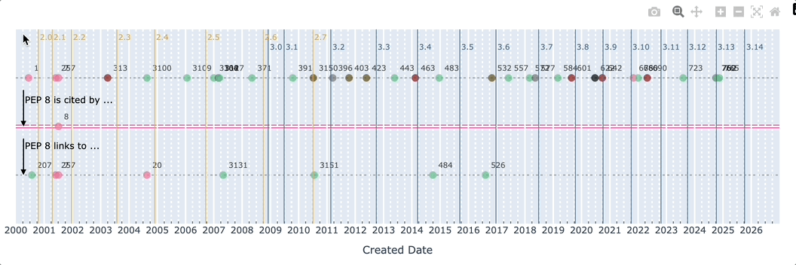

## Network tab
### Viewing Citation Structure
The network graph reveals structural patterns in PEP citation relationships.
- Nodes represent PEPs.
- Edges represent citation relationships.
- Larger nodes indicate higher connectivity based on the selected metric.

You may notice that PEPs naturally form clusters around specific themes, such as governance, documentation, type hints, or packaging.
These clusters represent groups of closely related PEPs.
Highly connected nodes tend to appear near the center of the graph, indicating influential or widely referenced PEPs.

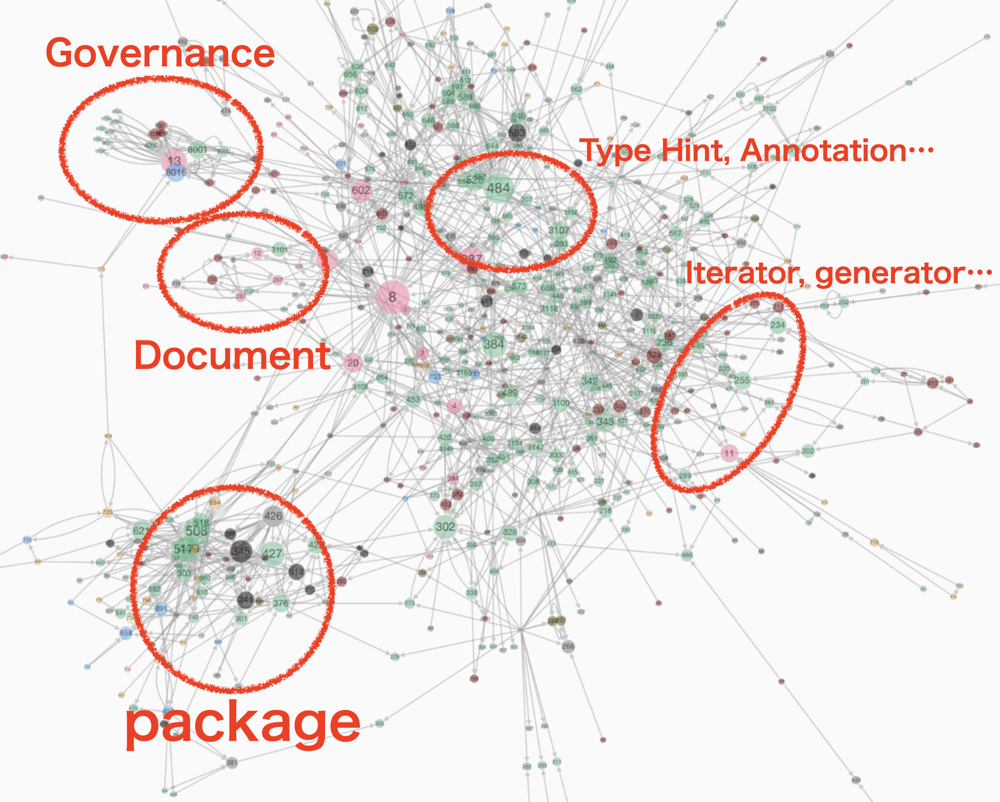

Enter a PEP number in the text box on the left (e.g., 8), or click a node in the network graph.
The selected PEP and its citation connections will be highlighted in the network graph.

- **Orange edges:** Other PEPs cite the selected PEP.
- **Blue edges:** The selected PEP cites other PEPs.

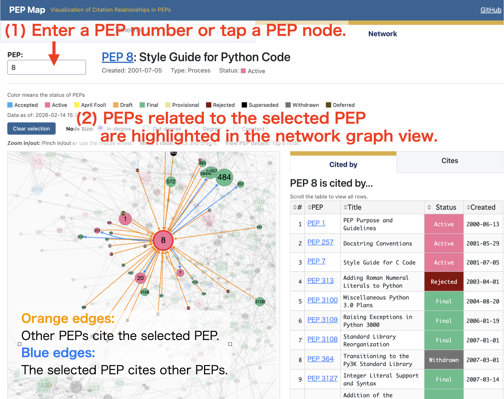

### Reset selection
Click the `Reset selection` button to clear the current node selection.


### Change node size
You can change the node size using the following five metrics:
- `In-degree`: The number of PEPs that cite the selected PEP. PEPs with a high in-degree are widely referenced and often influential.
- `Out-degree`: The number of PEPs that the selected PEP cites. PEPs with a high out-degree tend to reference many other PEPs and may serve as integrative or coordinating proposals.
- `Degree`: The sum of in-degree and out-degree.
- `Constant`: All nodes are displayed with the same size.
- `PageRank` : Network-based importance score computed from the overall citation structure.

If the selected metric is 0, the node is displayed with a default minimum size.


### Zoom and Pan
- **Zoom:** Use the mouse wheel (or pinch gestures) to zoom in and out.
- **Pan:** Click and drag the background to move the entire graph.

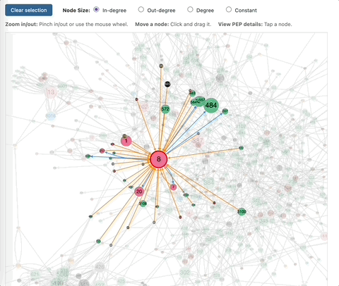
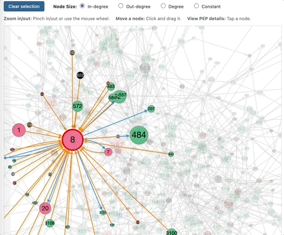

### Node Interaction
Drag a node to reposition it manually.

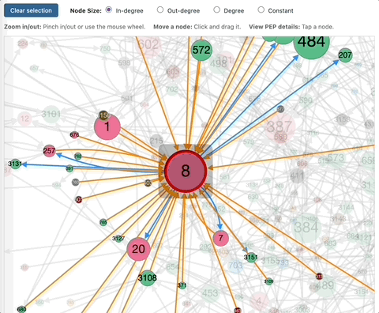

## Groups tab
### Viewing Topic Groups from Citations
The Groups tab shows how PEPs are organized into groups based on citation relationships.

Groups are detected automatically from the citation network using a community detection algorithm.
PEPs within the same group are more closely related to each other through citations.

This view helps you identify groups of related topics and understand how different areas of discussion are structured within the PEP ecosystem.

For example, enter `484` (PEP 484: Type Hints) in the PEP input field.
You will see that PEPs related to annotations and typing are grouped together.

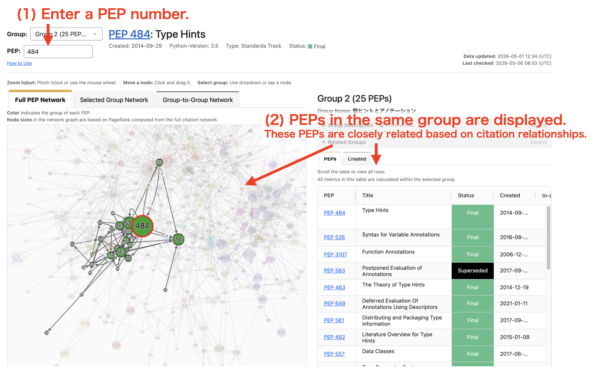

You can select a group, enter a PEP number, or click a node in the network graph.

- Selecting a group highlights the corresponding PEPs in the network graph.
- Entering a PEP number or clicking a node automatically selects its group and highlights it.

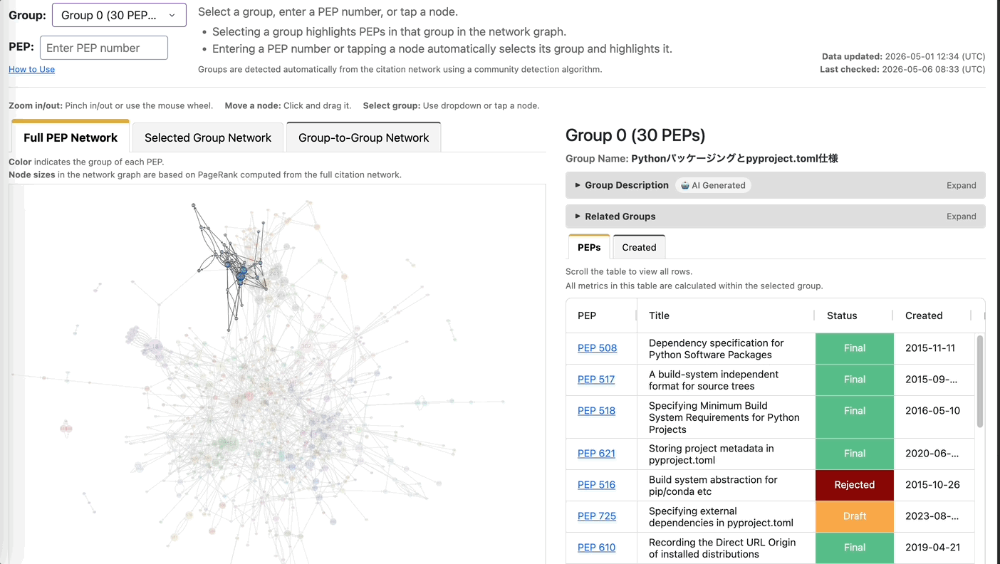

**NOTE:**
This feature is currently in beta. Automatic generation of group descriptions is planned.

## Local environment setup

```
$ python -m venv venv
$ source venv/bin/activate
(venv) $ pip install -r requirements.txt
```

```
(venv) $ python app.py
```

To enable debug mode (hot reload, interactive error display):

```
(venv) $ DEBUG=true python app.py
```
